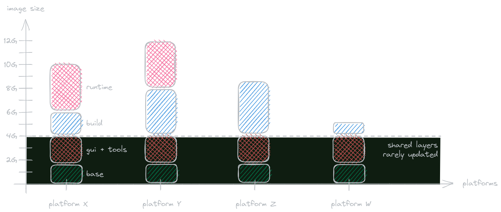

## Subverting expectations

Initially I just wanted to get rid of VMs. Linux-based tools shouldn't be confined to some virtual runtime. Installing
to native host system would lead to messy installs, with developers always contaminating their installation out of
their profound love for `sudo` or, to make matters worse, incremental updates leading to contaminated caches or partial
installs.

Why support hands-on debugging when you can distribute pristine baseline image? Well at least that was my reasoning.

## Virtual Machines

VMs are a staple on embedded development. For historic reasons companies embrace Windows as host system and then manage
libraries of VMs aimed at all kinds of development processes.

Embedded development is powered by bloated vendor tooling (I even
[helped to develop one](https://www.luxoft.com/videos/populus-webinar-recording)) that often combines the SDK (used by
majority of developers) with UI tooling (IDE-like, used by a small minority).

To limit the bloated VM images, embedded SDK would be redistributed either via a repository, or via mounted network fs,
or just downloaded from some file storage solution on demand. This allows relatively lightweight VMs that are
populated on the user end somewhat automatically.

I already had bad experience with wide adoption of VMs in greenfield projects. I had a hunch on how I would address
the known pitfalls:
* Reduce cadence of image updates
* Download and cache on local host as much as possible
* Promote/enforce snapshot usage to limit host contamination

There's not much to do with performance overhead, especially if you intend to run some emulation software (e.g. QEmu)
to emulate your target architecture. Hardware acceleration makes it a little more tolerable, but it's not even close to
native GNU+Linux environment.

## Docker image

I had some familiarity with Docker from hobby webdev projects, but those were mostly about deployment. I read through a
couple of articles on using Docker for development and decided to give it a try.

I will omit project- and tooling-related details, while focusing on how Docker helped us shape the development
ecosystem for 6 target platforms and >400 developers. You can find some technical details [here](../docker_deploy/).

The concepts are pretty simple, but there are several out-of-the-box advantages that come with Docker:
* _Developers like `sudo` and contaminating their environment?_ Give them ephemeral containers and teach them to
restart their containers to restore to baseline contents.
* _Network configurations vary greatly between developers?_ Configure Docker daemon once and forget about it.
* _File permission issues with mounted contents?_ Let a script create a local image with a mirrored host user.
* _Want to reproduce a build that failed on CI?_ Use the same image with CI-generated inputs, you will observe the same
behavior.

## Image size

Elephant in the room - we have to choose between giant images and mounting/downloading necessary artifacts.

Downloading the artifacts (SDK, runtime and potentially GUI tooling) would force us to choose local storage for them:
* some host directory (with potential for host contamination)
* local Docker image (as part of local setup)

Storing in host directory is risky, as developers are naturally drawn to `sudo` to resolve any permission issues they
face, and tracking if there were any unexpected changes is not trivial, see a great article by Avery Pennarun
"[mtime comparison considered harmful](https://apenwarr.ca/log/20181113)" - SDK would be distributed by some fileserver
and we can't make any guesses on the user host. We knew that majority of developers were running Windows with Ubuntu
under WSL or VMs, some were running native Ubuntu and a critical minority were running hand-crafted Arch distributions.
Developers were in all timezones from NA to EU to Asia. Efficiently ensuring that the downloaded copy was not tampered
with was considered unviable.

Storing the artifacts in the local Docker image seemed OK, as these artifacts would be stored in mostly untouched
state. This would also impose additional failure point for the CI - we want the CI experience to be cached as much as
possible. We want to have consistent environment between developer setup and CI, so we can't really use network
filesystem on CI and in-Docker caching for developers. Reproducibility of such build environment was also not trivial,
as relying on external distribution mechanisms adds an extra level of complexity to build environment description.

Assuming we utilize CI caching, Docker images are almost a perfect fit for our needs.

## Image hierarchy

And so we chose to have giant images and tune them to the best of our abilities. We share image layers across images,
so it's not as painful as it may seem. Eventually we settled on 4 image flavors (for the prototype toolchain) for each
of our target platforms:
* `test` - has only runtime installed, intended for headless test runtime
* `gui` - has GUI vendor tooling, intended for general IDE-like development
* `build` - based on `gui`, has only SDK installed, intended for headless builds
* `runtime` - based on `build`, installs runtime, intended for general development and test runtime

These images are monstrous, however they share the beefy base layers and we rarely update _all_ the layers when
releasing new images. Due to some vendor tooling quirks, developers had to use the `gui` image, even though most of
them didn't use the GUI part of it. Once vendor resolves portable usage of their tooling, it'd be a rather simple
exercise in creating the prototyped headless `build` and `runtime` images.

We checked if we could scale that approach to other platforms, and mostly we could - with the exception for Android's
AOSP. 70G image was too big even for us, so we settled on downloading the Android SDK on demand, while keeping the
image small.

In the end we've established a small taxonomy of images, with the biggest layers fully reused between different
platforms. Even if you were to download all of our platform images, it would take up about 30G of your space since
they all share common image layers underneath them and it's only the SDK/runtime portions that you'd download (which
is the same overhead as if we were to download those on demand).

To evaluate if we maintained the images correctly we used some in-house tools and the
[dive tool](https://github.com/wagoodman/dive). `dive` consistently reported 99.9% space efficiency, and our in-house
tools kept us in check to ensure we weren't `COPY`ing things we didn't need and other things that `dive` didn't check
for.

## Update cadence

The image updates were also manageable - since we'd only update the top layers, the fundamental things like GUI tooling
would not change. This had a very positive effect on download sizes for any updates.

Even if we had to deploy patches from the vendor - we'd deploy them on top of our common image. Sure, we'd have to
regenerate every image in the chain that's based on the updated one, but we'd batch requests to update images and only
perform image regeneration with bulk changes.

Half of our images would be updated quarterly with vendor tooling releases, while the other half would be updated 1-2
times a month, depending on the number of changes. We also automated our image release processes, so that image
generation would not affect team bandwidth and would be done on CI. Considering that all inputs are ready, images for
all platforms could be generated in just over an hour. Input preparation for the platforms would take another hour, so
if we need to perform a full redeployment, it'd take under 3 hours with minimal developer intervention.

In case of a full outage (no build caches, no images to bootstrap the environment from, etc.) we were able to restore
within a day, most of the time spent would be rebuilding from scratch the runtime and SDK input artifacts.

## Limitations

Editor integration was a bit tricky. With VMs it's straightforward - you just settle on working from the VM. With Docker
you want some flexibility. There are suggested approaches for
[VSCode](https://code.visualstudio.com/docs/devcontainers/containers) and
[Neovim](https://github.com/jamestthompson3/nvim-remote-containers) but they are tricky to set up if you want to share
your host configuration.

Alternatively you could create a local shim image that would install the editor of your liking inside the Docker image,
as well as any additional tools it needs (e.g. LSP) and reuse your host configuration for persistence. This is also a
bit clunky since you need to make sure that everything relevant is mounted to your container and that your container
will not contaminate your plugins with container-specific paths (e.g. your swap history, plugin-specific caches, etc).

I settled on running tmux with neovim in one window, and interactive docker session in the other. Sure, I don't get to
navigate _system_ paths of my docker container, but I still can navigate the full worktree and even run things via
`docker exec` or in ephemeral containers from my neovim.

## Lessons learned

Initially I was skeptical about running 10G docker images in production - that's just too much. But then, after
evaluating the use cases and weighing the benefits, I kind of learned to stop worrying and loved the ~~bomb~~
resulting ecosystem.

As long as you care about Docker image layers, as long as you keep yourself in check with validation and analysis, as
long as you automate the image creation process - Docker is a very strong alternative to NFS-powered build
environments.

Our build system was also pretty happy, as with reduced update cadence our build agents were able to cache our images
so we barely experienced any lead time in build environment preparations.

A lot of issues can be solved on the user-end, by utilizing some common setup scripts that "prepare" a remote Docker
image for your local environment (creating a host-mirrored user, mounting the credentials and licenses, etc).
